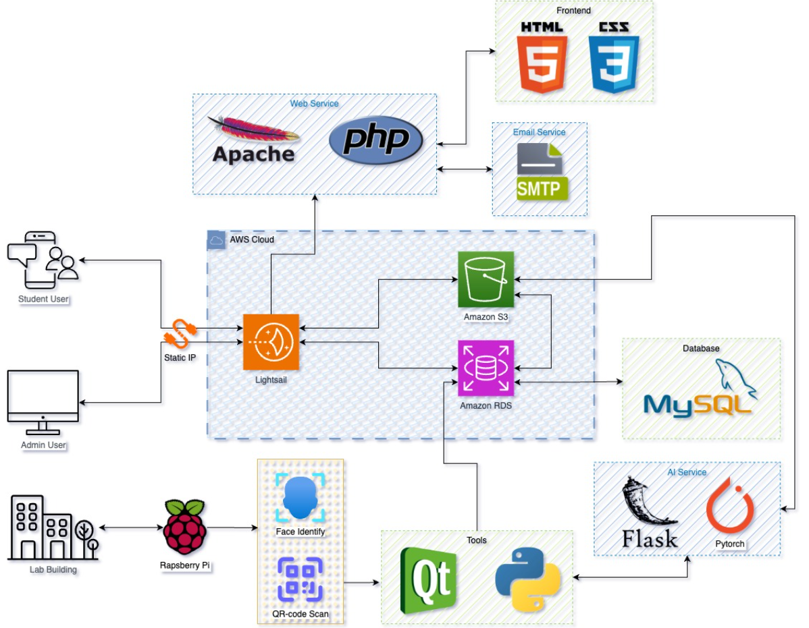

# Lab Access System

This project is part of our Capstone Design Project for Sungkyunkwan University.

## Overview
The **Lab Access System** is a Raspberry Pi-based solution for secure lab entry. It uses facial recognition and QR codes to validate student reservations, ensuring secure and seamless access during their reserved times.

## Related Repositories
- [Lab Reservation System - Website for Reservation](https://github.com/ICE3037-2024Fall-Team2/lab_reservation_system)  
    *(This repository contains the software we developed for managing lab reservations, including booking, scheduling, and database management, which is another part of our project.)*
---

## Full Project Architecture
- **Frontend**:
  - Built with **HTML**, **CSS**, **JavaScript**, **jQuery**, and **AJAX**.
  - Responsive design for both desktop and mobile users.
- **Backend**:
  - Powered by **PHP** and deployed on **AWS Lightsail**.
  - Uses APIs for managing reservations, facial recognition, and notifications.
- **Database**:
  - Managed with **MySQL** and hosted on **AWS RDS**.
- **AI and Hardware Integration**:
  - Facial recognition using **DeepFace Library** with the **ArcFace Model**.
  - **Raspberry Pi 5** and **Camera 3** for processing and access control.
- **Deployment**:
  - Images stored on **AWS S3** and served through pre-signed URLs.
  - SMTP service via **Google** for email notifications.

## System Flow
  
(The diagram shows the interaction between the frontend, backend, database, and hardware components.)

---

## Lab Access System Features
### Core Features
- **Facial Recognition Access**:
  - Uses AI-powered facial recognition via the DeepFace library (ArcFace model).
  - Matches the student’s face against their reservation photo for authentication.
- **QR Code Access**:
  - An alternative method for students to unlock the lab using a generated QR code.
- **Reservation Validation**:
  - Verifies reservations in real-time by communicating with the Lab Reservation System's database.
  
### Admin Features
- **Lab Setting**: Allows setting the device to any of the existing labs.

---

## Challenges and Solutions
- **Facial Recognition Lag**: Addressed by deploying the AI model locally on the Raspberry Pi.
- **Thread Freezing**: Resolved by handling requests asynchronously using the `aiohttp` library.
- **Library Compatibility**: Managed by setting up a virtual environment and finding substitute libraries when needed.

---

## Future Enhancements
- Integrate a real unlocking mechanism to control physical lab doors.
- Optimize response time for facial recognition by moving computations to the cloud.
- Add support for NFC or other alternative access methods.

---

## Contributors
- **Igor Briukhov** (Backend, Testing, Team Leader)
- **Yiqin Wei** (Backend, Database, Cloud System)
- **Nhat Minh Nguyen** (Hardware Assembly)

---

## References
- **DeepFace Library**: Provided the core facial recognition capabilities.
- **Raspberry Pi Documentation**: Offered guidance for hardware integration.
- **AWS Documentation**: Assisted with cloud storage and database connectivity.
